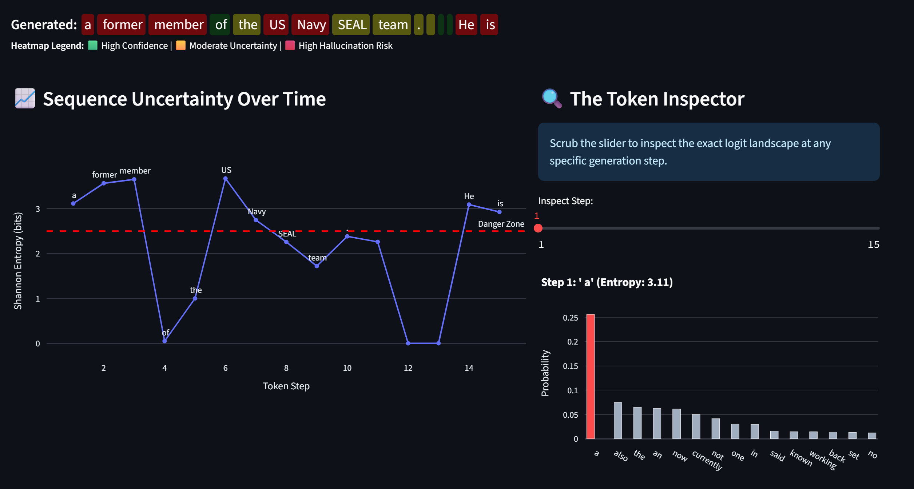

# Logit-Dynamics: The Observatory


A research-grade application for analyzing Large Language Model (LLM) inference mechanics, visualizing probability distributions, and mitigating hallucinations in real-time.

## 📸 Application Screenshots


> **Figure 1:** The main generation console featuring a Shannon Entropy-based color heatmap. Green indicates high model confidence; red flags potential hallucinations and guessing.


> **Figure 2:** The dual-chart telemetry view. The line chart tracks sequence uncertainty over time, while the Token Inspector allows users to scrub through history and view the exact Top-15 logit landscape at any specific generation step.

## 🚀 Overview

Decoding strategies (like Top-K or Nucleus/Top-P sampling) often act as black boxes in production systems. **Logit-Dynamics** intercepts the forward pass of the Transformer architecture to expose and manipulate the raw logit landscape. 

It helps understand how models make decisions, calculate uncertainty, and mathematically engineer factual truth into the text generation process.

## ✨ Key Features

* **Custom Inference Engine:** Manually computes Softmax, Temperature scaling, and autoregressive sequence generation.
* **Advanced Decoding (DoLa):** Implements layer-contrastive decoding to suppress hallucinations.
* **Uncertainty Quantification:** Calculates **Shannon Entropy** at every single token step to create a real-time "hallucination warning system"
* **Application UI:** Features an interactive dashboard that allows developers to scrub through generated text and perform post-mortem analysis on where the model's probability distribution flattened out.

## 🔬 Mathematical Architecture

### 1. Contrastive Subtraction (DoLa)
**DoLa (Decoding by Contrasting Layers)** is a SOTA methodology introduced to reduce confident hallucinations. Language models process grammar and syntax in their early (premature) layers, and factual knowledge in their later (mature) layers. Hallucinations frequently occur when the model defaults to plausible-sounding, statistically common syntax instead of facts.

This engine projects hidden states from both a mature and premature layer into vocabulary logits, and applies the following penalty:

$$S(y_t) = z_{\text{mature}} - \alpha \cdot z_{\text{premature}}$$

Tokens that rely solely on grammatical likelihood are neutralized, while factual tokens experience a mathematical spike.

### 2. Shannon Entropy Monitor
The sequence generation is monitored via real-time entropy calculation:

$$H(X) = - \sum_{i=1}^{n} P(x_i) \ln P(x_i)$$

Spikes in $H(X)$ indicate the model's internal probability distribution has flattened (it is guessing between many options), serving as an early-warning system for model degeneration or hallucination.

## 💻 Core Implementation Snippets

### The Logit Mathematics
```python
# Extract logits for the final token
next_token_logits = outputs.logits[0, -1, :]

# Apply Temperature scaling to control distribution entropy
temperature = max(temperature, 1e-5)
scaled_logits = next_token_logits / temperature

# Convert unconstrained logits into a probability distribution
probs = F.softmax(scaled_logits, dim=-1)
```

### The DoLa Intervention
```python
# Project hidden states from both deep and shallow layers into vocabulary logits
mature_logits = self.model.lm_head(mature_hidden)
premature_logits = self.model.lm_head(premature_hidden)

# Contrastive Subtraction: Penalize early-layer syntax, amplify late-layer facts
contrastive_logits = mature_logits - (alpha * premature_logits)

# Dynamic Masking: Prevent the amplification of completely irrelevant tokens
mask = mature_probs < threshold
contrastive_logits[mask] = -float('inf')

# Convert the engineered logits back into probabilities
dola_probs = F.softmax(contrastive_logits, dim=-1)
```

### The Entropy Calculation
```python
def calculate_shannon_entropy(probs, epsilon=1e-9):
    """
    Calculates the Shannon Entropy of a probability distribution.
    High Entropy = Flat Distribution = High Uncertainty / Hallucination Risk.
    Low Entropy = Sharp Distribution = High Confidence.
    """
    # -Sum( P(x) * log(P(x)) )
    entropy = -torch.sum(probs * torch.log(probs + epsilon))
    return entropy.item()
```

## 🛠️ Installation & Usage

1. **Clone the repository:**
```python
git clone https://github.com/RamuNalla/Logit-Dynamics-Advanced-Decoding-Entropy-Control.git
cd Logit-Dynamics-Advanced-Decoding-Entropy-Control
```

2. **Set up the environment:**
```python
python3 -m venv venv
source venv/bin/activate  
pip install -r requirements.txt
```

3. **Run the Streamlit app:**
```python
streamlit run app.py
```

## 📂 Project Structure
```text
Logit-Dynamics-Advanced-Decoding-Entropy-Control/
│
├── src/
│   ├── model_loader.py       # Caching and loading logic (GPT-2)
│   ├── samplers.py           # Standard sampling math (Greedy, Top-K, Top-P)
│   ├── advanced_decoding.py  # DoLa implementation
│   └── metrics.py            # Shannon Entropy quantification
│
├── app.py                    # Main interactive Streamlit dashboard
└── requirements.txt          # Project dependencies
```
## 👨‍💻 Author
**Ramu Nalla** | *Lead Data Scientist*